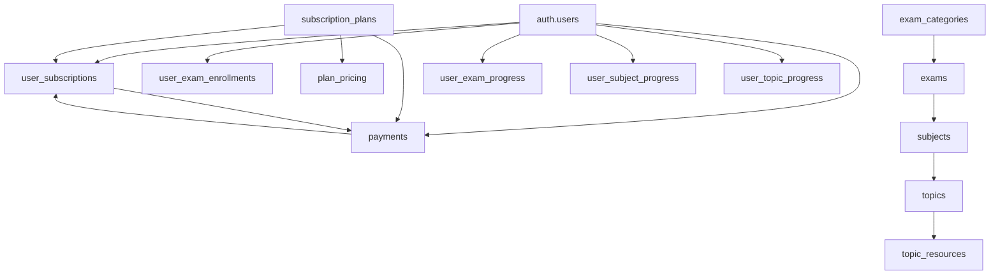

# 📊 Examtrakr Database Schema Documentation

## 🏗️ Database Overview

Examtrakr uses a PostgreSQL database with Supabase as the backend service. The database is designed to support a comprehensive exam preparation platform with subscription management, progress tracking, and resource management.

## 📋 Table Categories

### 🔐 **Authentication & User Management**
- `auth.users` (Supabase managed)
- `users` - Extended user profiles (bridges auth.users)
- `user_roles` - User role assignments
- `user_sessions` - Session management

### 💳 **Subscription & Payment System**
- `subscription_plans` - Available subscription plans
- `plan_pricing` - Regional pricing for plans
- `payments` - Payment transaction records
- `user_subscriptions` - Active user subscriptions
- `pricing_offers` - Limited time offer settings (discount & countdown timer)

### 📚 **Exam Structure**
- `exam_categories` - Exam categorization
- `exams` - Main exam definitions
- `subjects` - Subjects within exams
- `topics` - Topics within subjects

### 📖 **Learning Resources**
- `topic_resources` - Learning materials (videos, PDFs, etc.)
- `resource_ratings` - User ratings for resources
- `user_resource_bookmarks` - Bookmarked resources

### 📈 **Progress Tracking**
- `user_exam_enrollments` - User exam enrollments
- `user_exam_progress` - Overall exam progress
- `user_subject_progress` - Subject-level progress
- `user_topic_progress` - Topic-level progress
- `topic_difficulty_ratings` - User difficulty ratings

### 🔧 **System Management**
- `app_settings` - Application configuration
- `exam_requests` - User exam requests
- `user_feedback` - User feedback collection

## 🔗 Key Relationships

## 📊 Database Statistics

| Category | Tables | Key Features |
|----------|--------|--------------|
| **User Management** | 4 | Authentication, profiles, roles, sessions |
| **Subscriptions** | 5 | Plans, pricing, payments, subscriptions, offers |
| **Content Structure** | 4 | Categories, exams, subjects, topics |
| **Resources** | 3 | Materials, ratings, bookmarks |
| **Progress Tracking** | 5 | Multi-level progress tracking |
| **System** | 3 | Settings, requests, feedback |

## 🚀 Performance Features

### **Indexes**
- ✅ User-based queries optimized
- ✅ Progress tracking optimized
- ✅ Payment lookups optimized
- ✅ Content hierarchy optimized

### **Constraints**
- ✅ Foreign key relationships enforced
- ✅ Data integrity checks
- ✅ Unique constraints where needed
- ✅ Check constraints for enums

### **Triggers**
- ✅ Automatic timestamp updates
- ✅ Data validation triggers
- ✅ Progress calculation triggers

## 📁 Schema Files

Each table schema is documented in separate files:

- `01_core_tables.sql` - Core system tables
- `02_subscription_system.sql` - Payment and subscription tables
- `03_exam_structure.sql` - Exam hierarchy tables
- `04_progress_tracking.sql` - User progress tables
- `05_resources_system.sql` - Learning resources tables
- `06_user_management.sql` - User-related tables
- `09_users_table.sql` - Extended users table (bridges auth.users)
- `14_pricing_offers_table.sql` - Limited time offers configuration

## 🔧 Setup Instructions

1. **Create Database**: Set up PostgreSQL database in Supabase
2. **Run Migrations**: Execute SQL files in order
3. **Set Permissions**: Configure Row Level Security (RLS)
4. **Create Indexes**: Ensure all performance indexes are created
5. **Test Relationships**: Verify foreign key constraints

## 📈 Scalability Considerations

- **Partitioning**: Large tables can be partitioned by date
- **Archiving**: Old progress data can be archived
- **Caching**: Frequently accessed data cached at application level
- **Read Replicas**: Can be added for read-heavy workloads

## 🔒 Security Features

- **Row Level Security (RLS)**: Enabled on all user-facing tables
- **Foreign Key Constraints**: Prevent orphaned records
- **Data Validation**: Check constraints ensure data quality
- **Audit Trail**: Created/updated timestamps on all tables
